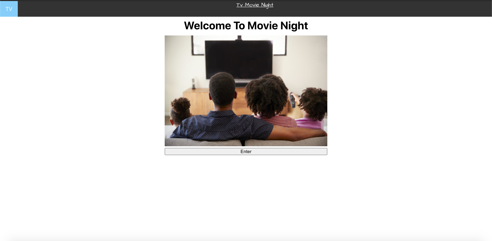
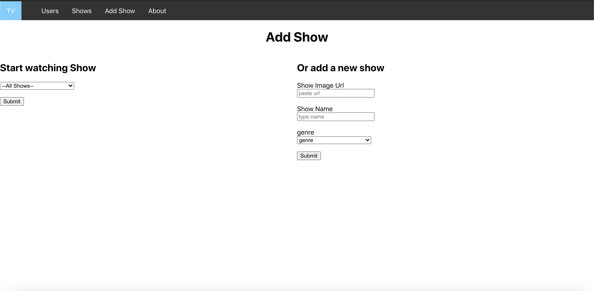
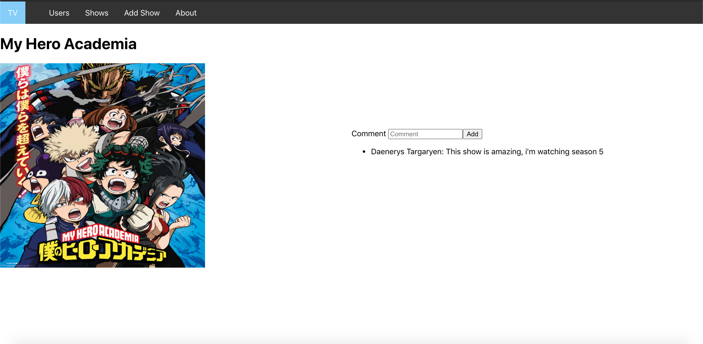

# [TV Movie Night](https://movie-night-jf.netlify.app/)

Tv Movie Night is a full-stack application where users can post, comment on, and favorite TV shows that they are binging on.

### Features

- The app uses faux user authentication. To simulate a user logging in.

- Users can view the profile pages of other users and see the shows they are watching.

- Users are able to **add shows** that they watch. These shows are shared on their profile pages.

- Users are able to **leave comments** on shows. Comments include the comment's text as well as the username of the user who posted the comment.

### Technologies 

Movie Night App was created using

- React
- Express.js
- SQL
- Netlify
- Heroku

